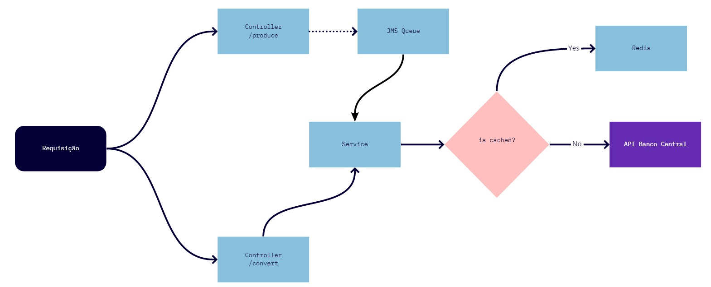

# Currency Converter - Codex Challange

This application consumes an API from Banco Central do Brasil. The documentation for this external API is available [here](https://dadosabertos.bcb.gov.br/dataset/taxas-de-cambio-todos-os-boletins-diarios).

This application is capable of converting currencies from one currency to another based on the specific day's pricing.

## Installation

To be able to run the project you must have installed Java 11 and Redis in your machine.

Once you have done that, you will proceed the following command into source folder:

`.\mvnw spring-boot:run`

P.S: Wheter you have credentials to access your redis service, you must provide it into application.properties.

## Usage

There are two endpoints, one to process a Sync GET Request and other to produce an Async JMS Message.

The first GET endpoint is available on:
`localhost:8080/currency/convert`

You must provide the following query params:

- dataCotacao: MM-dd-YYYY
- moedaOrigem
- moedaDestino
- valor: must be a double value

The available coins to use are:
DKK,
NOK,
SEK,
USD,
AUD,
CAD,
EUR,
CHF,
JPY,
GBP,
BRL

The second GET endpoint to produce a JMS Message to a queue usigin priority.
The GET endpoint is available on:
`localhost:8080/currency/produce`. The request payload is same as the first one, but this you can set the priority passing the query param `priority`, an int value between 1 and 9, 1 has less priority and 9 has the most priority.

The server JMS is embbeded to the application and the app listen the queue named `convert-queue`, this queue named can be changed via application.properties.

## Architecture

The following diagram represents the application architecture. We have two endpoints, one to produce an Async JMS message and other to process a Sync Get Message. Both of them consume the same service, if it is cached it is retrived from redis, else it will request to an external API.

